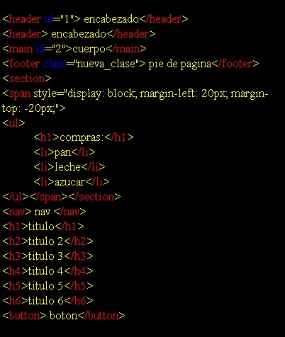

# paint-code

### version 2.1.0

<h4>Colorea tu código para que se vea <b>elegante</b></h4>

#

Solo debes colocar el script en tu html y agregar la clase colorear al padre:
#

<pre>
<code>
   &lt;script type="module" &gt;  
       import{ColorearHtml} from 'https://lionelstaricoff.github.io/paint-code/Paint.js';
       new ColorearHtml();
      &lt;script&gt;
</code>
</pre>

#

## Utiliza el constructor 

### Personaliza tus colores: etiquetas,atributos,fondo y letras:

<pre>
<code>
   &lt;script type="module" &gt;  
       import{ColorearHtml} from 'https://lionelstaricoff.github.io/paint-code/Paint.js';
      new ColorearHtml('red','blue','black','yellow');
      &lt;script&gt;
</code>
</pre>

#

## Utiliza el constructor Builder

### Puedes pasar por parámetro nombres de colores, colores hexadecimal, RGB, RGBA, HLS, HWB y también puedes usar la clase estática ColorearHtml.colores();

<pre>
<code>
   &lt;script type="module" &gt;  
       import{ColorearHtml} from 'https://lionelstaricoff.github.io/paint-code/Paint.js';

     ColorearHtml.Builder()
                           .etiquetas('rgb(26, 76, 76)')
                           .background('#333')
                           .atributos('hsl(350, 100%, 88%)')
                           .letras('hwb(0 100% 0%)')
                           .build()
      &lt;script&gt;
</code>
</pre>

&copy; Todos los derechos recervados por mi <a target=_blank href="https://www.linkedin.com/in/lionel-staricoff/"> Staricoff Lionel</a>

