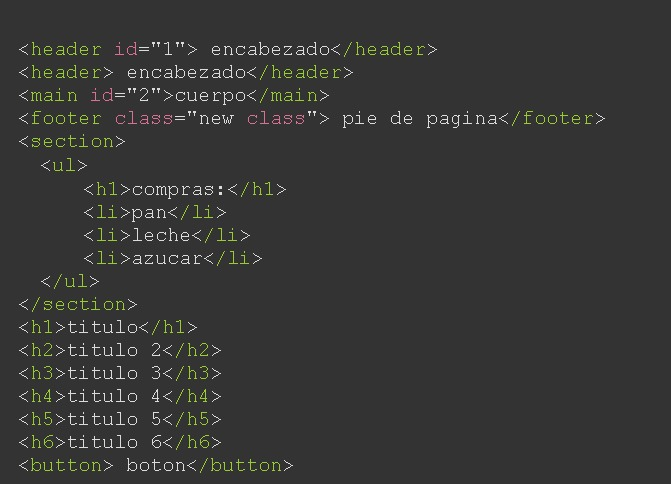
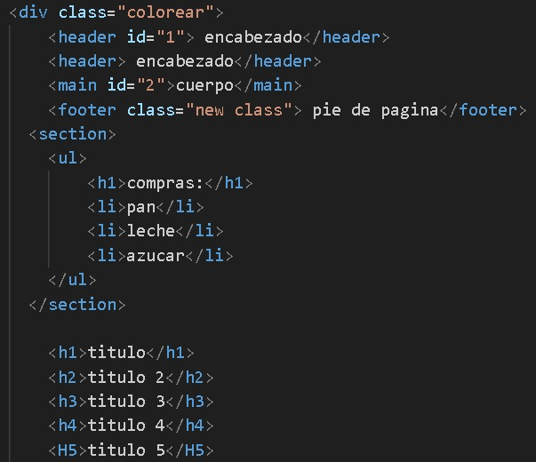

# paint-code

### version 1.0.2

<h4>Colorea tu código para que se vea <b>elegante</b></h4>

#

Solo debes colocar el script en tu html y agregar la clase colorear al padre:
#

<pre>
<code>
   &lt;script type="module" &gt;  
       import{ColorearHtml} from 'https://lionelstaricoff.github.io/paint-code/Paint.js';
       new ColorearHtml();
      &lt;script&gt;
</code>
</pre>

#

&copy; Todos los derechos recervados por mi <a target=_blank href="https://www.linkedin.com/in/lionel-staricoff/"> Staricoff Lionel</a>

